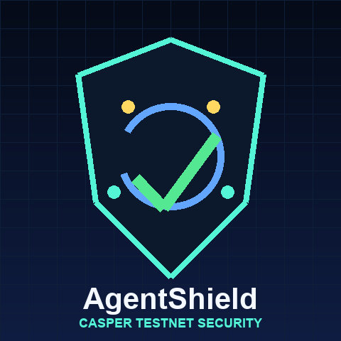

# Casper AgentShield

<p align="center">
  
</p>

**Pre-signing security runtime for autonomous Casper agents.** AgentShield evaluates AI-agent transaction intents before wallet signing, blocks unsafe actions, and anchors compact decision proofs on Casper Testnet.

Built for the **Casper Agentic Buildathon 2026 - Qualification Round**.

## Why it matters

Agentic wallets can pay APIs, call contracts, rebalance portfolios, and coordinate DeFi/RWA workflows. The risk is that prompt injection, bad tool output, or unsafe routing can still reach the signing step. AgentShield sits between the agent and wallet signing so high-risk actions can be blocked or escalated before funds move.

## Implemented MVP

- TypeScript policy engine for Casper agent tool requests.
- Prompt-injection, target, method, network, spend-cap, and intent-mismatch checks.
- Deterministic `intent_hash`, `policy_hash`, `evidence_hash`, and `decision_hash` generation.
- Offers a judge-ready dashboard with safe, risky, mainnet-review, dangerous-admin, unlimited-approval, unknown-target, and intent-mismatch scenarios.
- CLI demo for repeatable ALLOW / REVIEW_REQUIRED / BLOCK evaluations.
- Casper session WASM that writes AgentShield proof fields to Casper Testnet account named keys.
- Odra-style `AgentShieldDecisionLog` contract source for the longer-lived proof registry path.
- Vitest coverage and GitHub Actions CI for the TypeScript prototype.

## Demo video

Watch the 2:33 judge walkthrough: [`demo/casper-agentshield-demo.mp4`](demo/casper-agentshield-demo.mp4)

For DoraHacks, prefer a public YouTube/Loom URL and keep this MP4 as repo evidence.

## Quick start

```bash
npm install
npm test
npm run build
npm run dev
```

## CLI demo

```bash
npm run agent:demo
npm run casper:hash prompt-injection-drain
```

## Architecture

```text
AI Agent Intent / Tool Request
        |
        v
AgentShield Policy Engine
  - prompt-injection scan
  - target/method allowlist
  - spend cap
  - network policy
  - intent mismatch check
        |
        +--> BLOCK before wallet signing
        +--> REVIEW_REQUIRED for human approval
        +--> ALLOW then sign/broadcast
        |
        v
Casper Testnet Decision Anchor
  session code writes compact proof fields to account named keys:
  agentshield_action_id
  agentshield_decision
  agentshield_risk_score
  agentshield_intent_hash
  agentshield_policy_hash
  agentshield_evidence_hash
  agentshield_decision_hash
```

## Casper Buildathon fit

| Requirement | Evidence in this repo |
| --- | --- |
| Working prototype | React dashboard, CLI demo, policy engine, scenarios, tests, and build scripts. |
| Casper Testnet on-chain component | Live deploy hash `0073e5c2595185eb9145ce60dbf9ac40d779f6fe6985dbd138701a4a72dd0e06` on `casper-test`. |
| Transaction-producing behavior | The deploy writes AgentShield named keys and decision hashes to a funded Testnet account. |
| Open-source repo with README and usage | Setup, run, architecture, deployment, submission copy, tests, and source code are included. |
| Demo video | Repo MP4 is included; submit a public hosted video link on DoraHacks. |
| Agentic AI focus | AgentShield protects autonomous wallet/tool actions before signing. |
| DeFi/RWA relevance | Applies to yield agents, RWA oracle agents, DAO treasury agents, x402 services, and compliance agents. |

## Casper Testnet evidence

- Public key: `0202e9f14df2d1462e43879fb944eb16060864840d350893b25c16cdb3ed95ae9fc4`
- Account hash: `account-hash-faee5abfbc6fbeda319093a2a9896ab1eff39e2883af2414a27e7a1d18400dda`
- RPC: `https://node.testnet.casper.network`
- Deploy hash: `0073e5c2595185eb9145ce60dbf9ac40d779f6fe6985dbd138701a4a72dd0e06`
- Explorer: <https://testnet.cspr.live/deploy/0073e5c2595185eb9145ce60dbf9ac40d779f6fe6985dbd138701a4a72dd0e06>
- Sample decision hash: `96526a72b11312a15cb456e90aa4aa7d99ee645b242af8eb0badee77f6d304e9`
- WASM SHA-256: `a5f9dbb062233741cb9eba4f44f46a648ef47e3f873658d0d7e772521b0265e3`

The live deploy writes these named keys:

- `agentshield_action_id`
- `agentshield_component`
- `agentshield_decision`
- `agentshield_decision_hash`
- `agentshield_evidence_hash`
- `agentshield_intent_hash`
- `agentshield_policy_hash`
- `agentshield_risk_score`

## Re-anchor a decision

Build the session WASM as described in [`docs/DEPLOYMENT.md`](docs/DEPLOYMENT.md), place a funded Testnet secret key at `.casper-testnet/agentshield/secret_key.pem`, then run:

```bash
bash scripts/deploy-anchor-docker.sh
```

The script is path-portable and can be configured with:

```bash
NODE_ADDRESS=https://node.testnet.casper.network \
PAYMENT_AMOUNT=30000000000 \
SECRET_KEY_PATH=.casper-testnet/agentshield/secret_key.pem \
SESSION_WASM=contracts/decision-session/target/wasm32-unknown-unknown/release/agentshield_decision_session.wasm \
bash scripts/deploy-anchor-docker.sh
```

## Roadmap

1. MCP server exposing `evaluate_intent` for Casper agents.
2. x402 paid API for pay-per-risk-check usage.
3. Casper proof registry contract for reusable decision records.
4. TypeScript SDK for wallet and agent integrations.
5. Policy templates for DeFi, RWA oracle, DAO treasury, and compliance workflows.

## Honest MVP status

The current submission includes a working local prototype, passing test suite, dashboard, deployable Casper session WASM source, Odra contract source, demo video file, and verified Casper Testnet anchor evidence. MCP/x402 service deployment and the richer proof-registry contract are planned next steps, not required to run the current MVP.